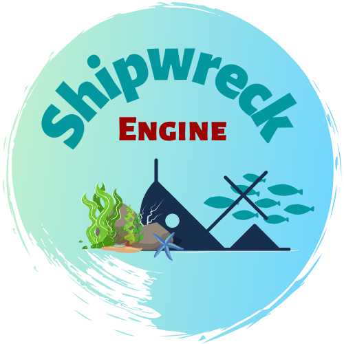

    

# ShipWreck engine (linux) ⚓
###### Project Template for linux

## Description :open_book:

ShipWreck Engine is a project built to learn how graphical programming works. \
We have some basics features, and we want to add more and more new cool feature. \
The long term objective is to build an Engine that allow you to make a realistic animation \
via our render engine and making a game with the same project (but not the same render engine).

This is a template to make your project with ShipWreck Engine on linux platform. \
This repository contains all you need and doesn't contain any example. \
We have a [documentation][docs] to get started with our Engine. \
Check our repository (_Coming soon_) with all example and full of utilities

## Installation :hammer_and_pick:
* Clone the repo `git clone https://github.com/Creative-Rift/template_linux.git`
* Open the project with your IDE 
* All done! :boat: 

## Quick Start :runner:
When you want to test you project follow these steps:

* Open a terminal
* Go to your project's root directory
* Run `./check_for_update.sh -b` to build your project
* Then you can start your project! :boat:

## Useful links :eyes:
* [Web site][web] :anchor:
* [Documentation][docs] :open_book:
* Utils (_Coming soon_) :gear:
* Examples (_Coming soon_) :mag:

## Authors

Made with :heart: \
Creative Rift Team ⚓

[web]: http://www.creative-rift.com/
[docs]: https://docs.creative-rift.com/
[utils]: https://docs.creative-rift.com/